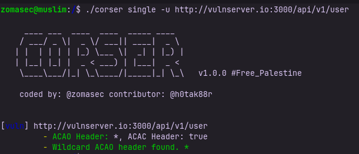

<p align="center">
  <a href="https://pkg.go.dev/github.com/cyinnove/corser/pkg/corser"></a>
  <a href="https://goreportcard.com/report/github.com/cyinnove/corser"></a> 
<!-- <a href="https://codecov.io/gh/cyinnove/corser" > 
  
 </a> -->
  <a href="https://twitter.com/intent/follow?screen_name=zomasec"></a>
</p>


## Corser: Scanner For Advanced CORS Misconfiguration Detection

Welcome to the GitHub repository for **Corser**, a powerful command-line tool designed for detecting CORS misconfigurations in web applications. Corser is developed with the goal of providing security professionals and developers with an efficient means to identify and exploit CORS issues.

## Installation

Install Corser using the following command:

    go install -v github.com/cyinnove/corser/cmd/corser@latest

Or you can build it and run using docker :


    git clone https://github.com/cyinnove/corser
    docker build -t corser .
    docker run corser help


## Features

- **Single URL Scan:** Perform a CORS scan on a specified URL.
- **Multiple URL Scan:** Perform CORS scans on multiple URLs from a specified file.
- **Proxy Mode Scan:** Receives requests from an upstreaming proxy and scan them, Ex: BurpSuite, ZAP ...
- **POC Generation:** Generates POC Any bug found in the Single URL scan mode .
## Usage

Run Corser with the desired commands and options:

    corser [command] [flags]
    corser help # this for help 

### Available Subcommands

- `completion` Generate the autocompletion script for the specified shell.
- `help` Help about any command.
- `multi` Performs scans on multiple URLs from a specified file.
- `single` Performs a scan on a single specified URL.
- `proxy` Receives requests from an upstreaming proxy and scan them, Ex: BurpSuite, ZAP ...

#### [click here to know how to setup upstreaming proxy in burpsuite](https://forum.portswigger.net/thread/how-do-i-configure-an-upstream-proxy-in-2022-d6f128fc)

### Flags for `single` Command

| Flag         | Description                                                      |
|--------------|------------------------------------------------------------------|
| `-g, --gen-poc`  | Generate a PoC for any vulnerable request with the name of the URL and result found. |
| `-h, --help`     | Help for single command.                                         |
| `-u, --url`      | Specifies the URL to scan for CORS misconfigurations.            |

### Flags for `multi` Command

| Flag         | Description                                                      |
|--------------|------------------------------------------------------------------|
| `-h, --help`     | Help for multi command.                                          |
| `-l, --list`     | Specifies a file path containing URLs to scan, with one URL per line. |
| `-o, --output`   | Specifies the output file path where results should be saved.    |


### Flags for `proxy` Command

#### Don't use the global flags in proxy subcommand

| Flag         | Description                                                      |
|--------------|------------------------------------------------------------------|
| `-h, --help`     | Help for proxy command.                                          |
| `-p, --port`     | Specifies the port of the proxy server that will receive requests from burpsuite. |
| `-O, --origin`   | Sets the Origin header value to use in the scan requests.    |
| `-d, --deep-scan`| Enable deep scan for more advanced CORS bypass techniques.    |
| `-v, --verbose`| Enable verbose mode for detailed logs.    |


### Global Flags

| Flag         | Default        | Description                                             |
|--------------|----------------|---------------------------------------------------------|
| `-c, --concurrency` | 10             | Determines the concurrency level.                        |
| `-k, --cookie`      |                | Defines cookies to include in the scan requests.        |
| `-d, --deep-scan`   | false          | Enable deep scan for more advanced CORS bypass techniques. |
| `-H, --header`      |                | Specifies additional headers to include in the scan requests. |
| `-m, --method`      | "GET"          | Specifies the HTTP method to use when sending requests. |
| `-O, --origin`      | "https://zomasec.io" | Sets the Origin header value to use in the scan requests. |
| `-t, --timeout`     | 5              | Sets the timeout (in seconds) for each request.         |
| `-v, --verbose`     | false          | Enable verbose mode for detailed logs.                  |

### Sample Command Usage

- Single URL Scan:
  
      corser single -u/--url http://example.com

- Multiple URL Scan:

      corser multi -u/--list url_list.txt -o/--output results.txt


- Proxy Mode Scan:

      corser proxy -p/--port 9090


## Screen shots :





## Output :

```
{
  "result": [
    {
      "url": "http://127.0.0.1:3000/api/v1/user",
      "Vulnerable": true,
      "payload": "https://vulnserver.zomasec.io",
      "details": [
        "ACAO Header: *, ACAC Header: true",
        "Wildcard ACAO header found. *"
      ],
      "request_data": {
        "ACAO": "*",
        "ACAC": "true",
        "Headers": [
          "Authorization",
          "X-Requested-With",
        ],
        "Methods": [
          "POST",
          "GET",
          "OPTIONS",
          "DELETE"
        ]
      },
      "ErrorMessage": ""
    }
  ]
}
```


## Developed by :

- **Developer:** @zomasec
- **Contributor:** @h0tak88r (Sallam)

## TODO 
- Recheck at the preflight request correct usage
- Add http test origin
- Enhance the output of the tool (Adding description and explot and ...)
- add ability to control the output drom the user by adding flag like -d
